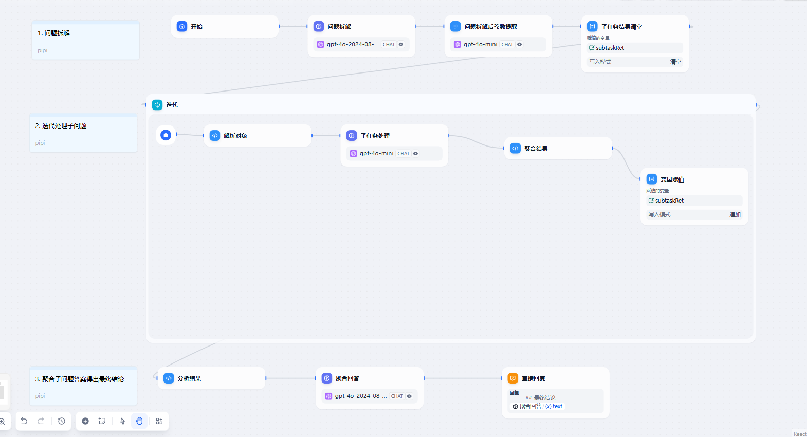
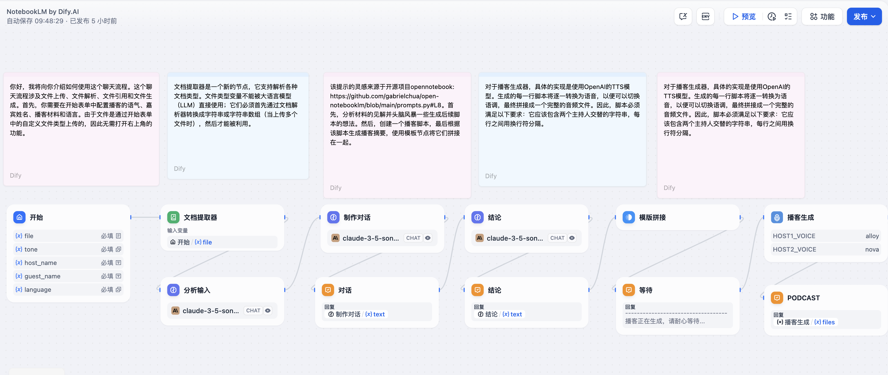
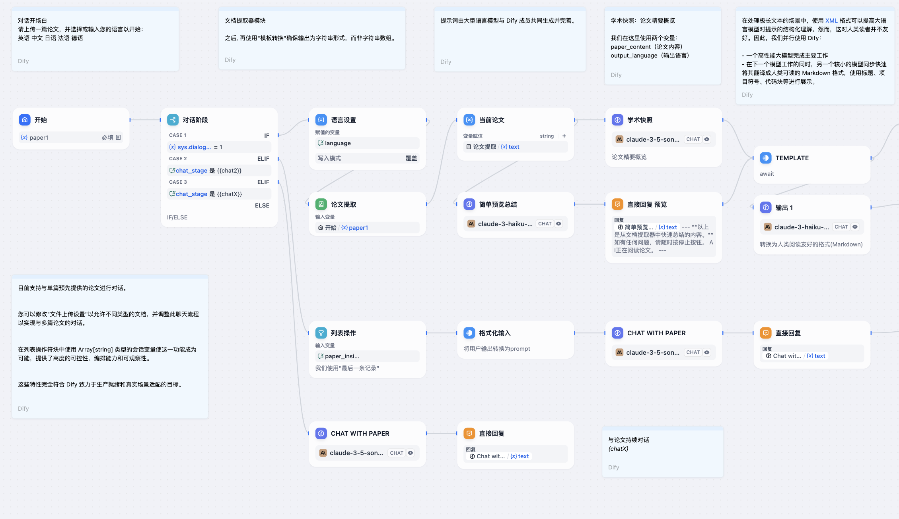
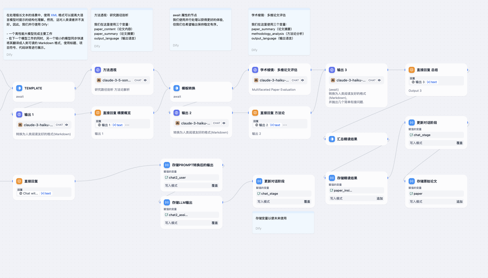
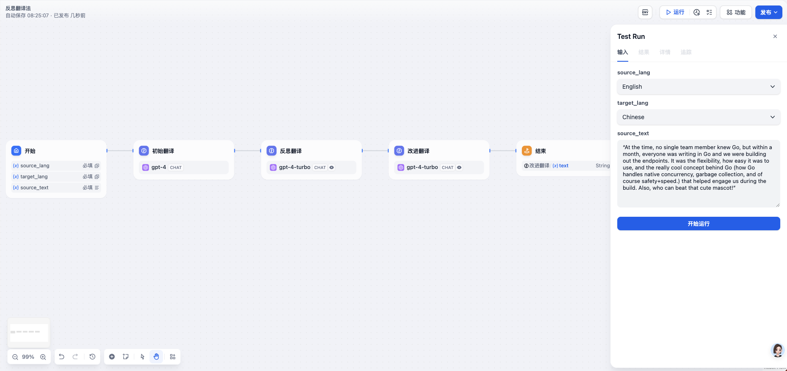
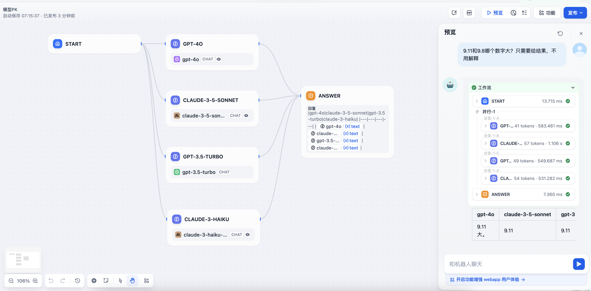
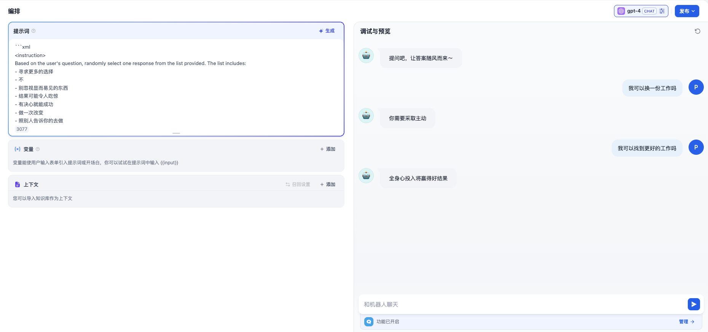
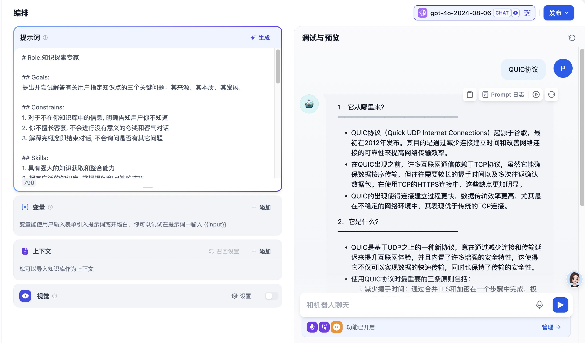
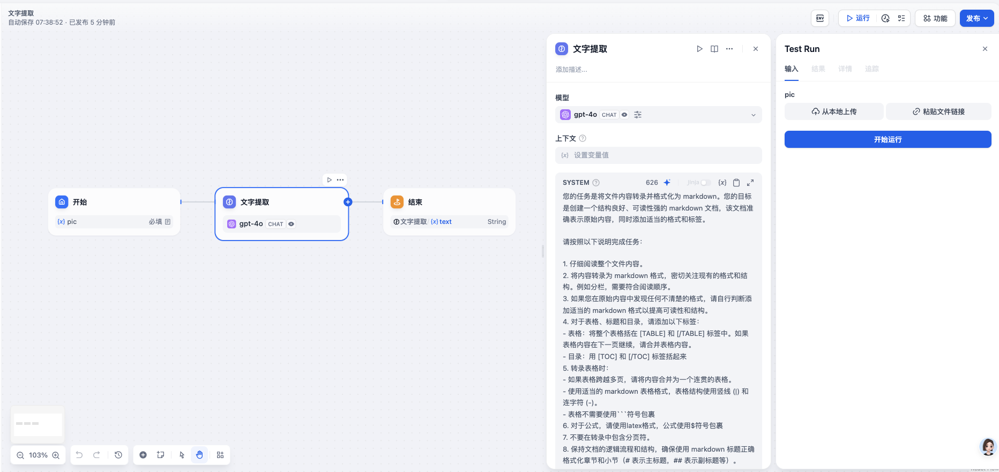

# dify-app-template
本仓库收集Dify优质应用模板

查看更多应用模版可访问：[dify-app](https://dify-app.zero-zero.cc/)

## 工作流
|名称|描述|模板|截图|
|---|---|---|---|
|任务拆解|通过工作流实现将复杂任务进行拆解成子问题，逐步解答子问题，最后聚合答案得到最终答案|[COT.yml](./workflow/Cot.yml)||
|NotebookLM|根据给定的资料生成播客|[NotebookLM.yml](./workflow/NotebookLM.yml)||
|ChatPaper|输入论文，然后根据论文内容对话|[ChatPaper.yml](./workflow/ChatPaper.yml)| |
|翻译-反思工作流|模拟了人类翻译专家的思考过程，首先进行直接翻译，然后进行反思，根据反对初始翻译进行优化|[TranslationReflection](./workflow/TranslationReflection.yml)||
|模型PK|同一个问题，多个大模型进行PK|[ModelPk](./workflow/ModelPK.yml)||

## 智能体

## 聊天助手
|名称|描述|模板|截图|
|---|---|---|---|
|答案之书|一个神秘又纯粹的回答者。不传递知识，也不带任何情感。它的回答就像抛硬币一样，完全随机，不可预测，但会让你发现你内心的答案。|[AnswerBook.yml](./chatbot/AnswerBook.yml)||
|知识探索|知识探索专家，提出并尝试解答有关用户指定知识点的三个关键问题：其来源、其本质、其发展。|[KnowledgeExploration.yml](./chatbot/KnowledgeExploration.yml)||

## 文本生成
|名称|描述|模板|截图|
|---|---|---|---|
|文字提取器|识别图片，提取文字内容，按照markdown格式输出|[TextExtraction.yml](./textCompletion/TextExtraction.yml)||
